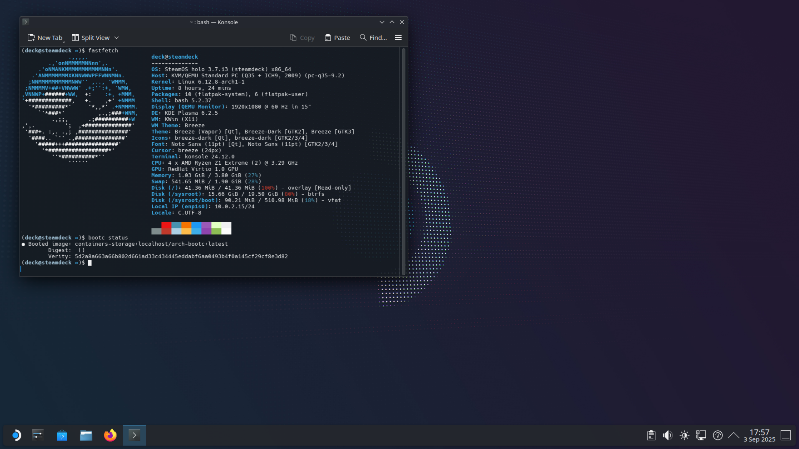

# SteamOS Holo Bootc

An extension on top of Tulip's experiments on arch-bootc (To get Arch Linux working in a Bootc environment) and SteamDeckHomebrew's holo-docker image to create a proof of concept Bootc-based SteamOS image.



This is by no means complete or intended for usage outside of a VM. Right now, the image includes a basic plasma session, flatpak and micro for a terminal-based text editor. More work will be done to try and get this image as close to SteamOS as possible.

## Building

In order to get a running steamos-bootc system you can run the following steps:
```shell
just build-containerfile # This will build the containerfile and all the dependencies you need
just generate-bootable-image # Generates a bootable image for you using bootc!
```

Then you can run the `bootable.img` as your boot disk in your preferred hypervisor.
